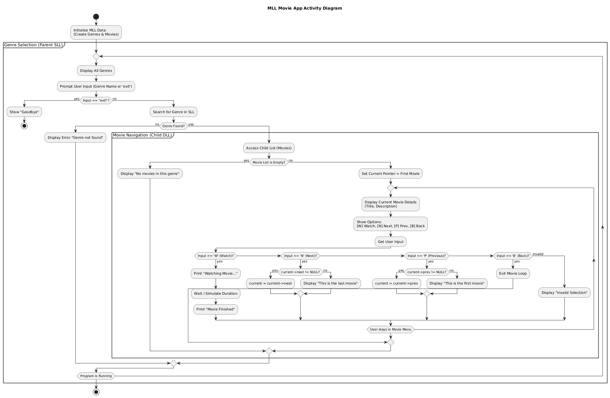

# Movie Catalog CLI

Name:
- Hafizh Azrial (1030124440017)
- Rakha Anargya Wibowo (103012440004)

A simple command-line interface (CLI) application for browsing a movie catalog, built with C++. This project demonstrates the use of a multi-linked list data structure to organize movies by genre.

## About The Project


This program allows users to navigate through different movie genres and view the movies within each genre. The core data structure is a multi-linked list where:
-   **Genres** are stored in a singly linked list (the parent list).
-   **Movies** are stored in a doubly linked list (the child list), with each movie list being associated with a specific genre.

Users can:
-   View a list of all available genres.
-   Select a genre to see the movies it contains.
-   Navigate forwards and backwards through the movie list within a genre.
-   "Watch" a movie, which displays its title and description.

## Getting Started

To get a local copy up and running, follow these simple steps.

### Prerequisites

You need a C++ compiler installed on your system, such as `g++`.

### Compilation

1.  Open your terminal or command prompt.
2.  Navigate to the project directory `C:\Tel-U\DSA\FP`.
3.  Compile the source files using the following command:
    ```sh
    g++ main.cpp source.cpp -o FP.exe
    ```
4.  After compilation, a `FP.exe` executable file will be created.

## How to Use

1.  Run the compiled program from your terminal:
    ```sh
    .\FP.exe
    ```
2.  The program will display a list of genres. Type the name of a genre exactly as shown and press Enter.
3.  You can then navigate the movies in that genre using the on-screen commands (`N` for next, `P` for previous, `W` to watch).
4.  To return to the genre list, select `B`.
5.  To quit the program, type `exit` in the main genre menu.

## Special Thanks To


- Lecturer Dody Qori Utama and its assistants also the whole Data Structure and Algorithm teaching team at School of Computing in Telkom University
- All of the lecturers at School of Computing in Telkom University
- All of IF-48-INT and its Academic Advisor
